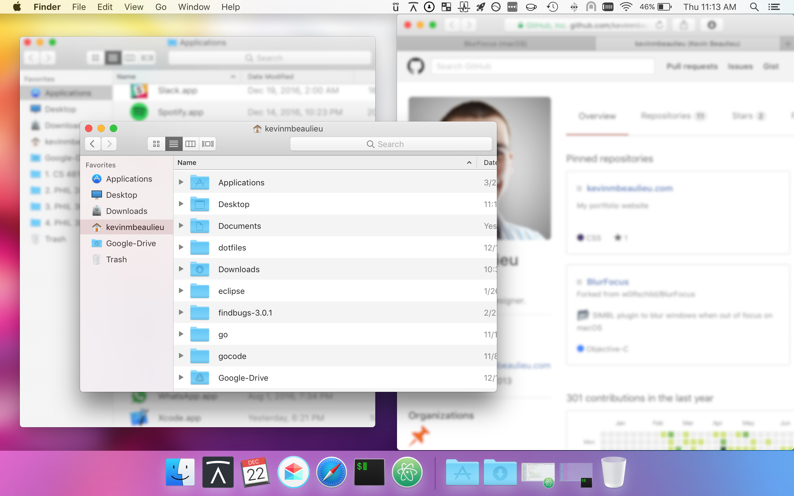

# BlurFocus

# Information:

- Designed for 10.12+
- SIMBL plugin to blur background windows on OS X
- Authors:
    + [Kevin Beaulieu](https://github.com/kevinmbeaulieu)  
    + [Wolfgang Baird](https://github.com/w0lfschild) (Original)

# Installation:

1. Download [mySIMBL](https://github.com/w0lfschild/app_updates/raw/master/mySIMBL/mySIMBL_0.2.5.zip)
2. Download latest release of [BlurFocus](https://github.com/kevinmbeaulieu/BlurFocus/releases/latest)
3. Unzip downloads
4. Open `BlurFocus.bundle` with `mySIMBL.app`
5. Logout & log back into macOS (or alternatively, restart all open applications including Finder).

### License:
Pretty much the BSD license, just don't repackage it and call it your own please!    
Also if you do make some changes, feel free to make a pull request and help make things more awesome!
